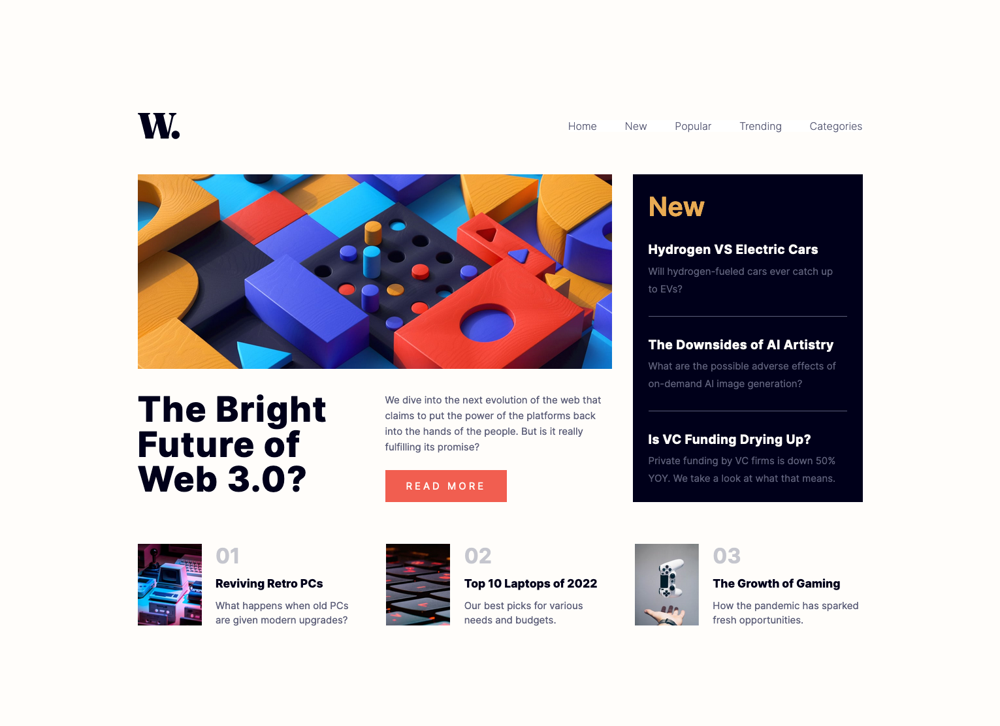
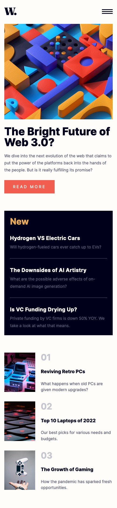

# Frontend Mentor - News homepage solution

This is a solution to the [News homepage challenge on Frontend Mentor](https://www.frontendmentor.io/challenges/news-homepage-H6SWTa1MFl). Frontend Mentor challenges help you improve your coding skills by building realistic projects. 

## Table of contents

- [Overview](#overview)
  - [The challenge](#the-challenge)
  - [Screenshot](#screenshot)
  - [Links](#links)
- [My process](#my-process)
  - [Built with](#built-with)
  - [What I learned](#what-i-learned)
  - [Continued development](#continued-development)
- [Author](#author)
- [Acknowledgments](#acknowledgments)

## Overview

### The challenge

Users should be able to:

- View the optimal layout for the interface depending on their device's screen size
- See hover and focus states for all interactive elements on the page
- **Bonus**: Toggle the mobile menu (requires some JavaScript)

### Screenshot

### Links

- Solution URL: [FrontendMentor.io]()
- Live Site URL: [https://ericsalvi.github.io/news-homepage-challenge/](https://ericsalvi.github.io/news-homepage-challenge/)

## My process

### Built with

- Semantic HTML5 markup
- CSS variables
- Variable Google fonts
- Flexbox
- CSS Grid
- Mobile-first workflow
- AXE Dev Tools

### What I learned

This particular project was a collaboration with [@maiaflow](https://github.com/maiaflow). We learned how to do one of these projects working together. We learned how to use Live Share from VSC. We learned how to use Variable Fonts and response Image Tags. 

### Continued development

I am looking forward to doing more collaborations with [@maiaflow](https://github.com/maiaflow).

## Author

- Website - [Eric Salvi](https://github.com/ericsalvi)
- Frontend Mentor - [@ericsalvi](https://www.frontendmentor.io/profile/ericsalvi)
- Website - [Maiaflow](https://github.com/maiaflow)
- Frontend Mentor - [@maiaflow](https://www.frontendmentor.io/profile/maiaflow)

## Acknowledgments

Thank you Maia for dealing with me while we worked on this project together. Great way for us to collab and learn how possibly other companies do similar projects. I do hope you learned things from myself. 